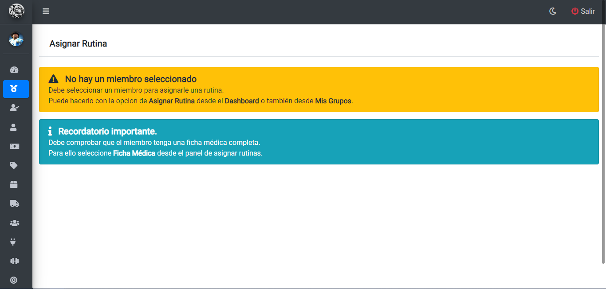
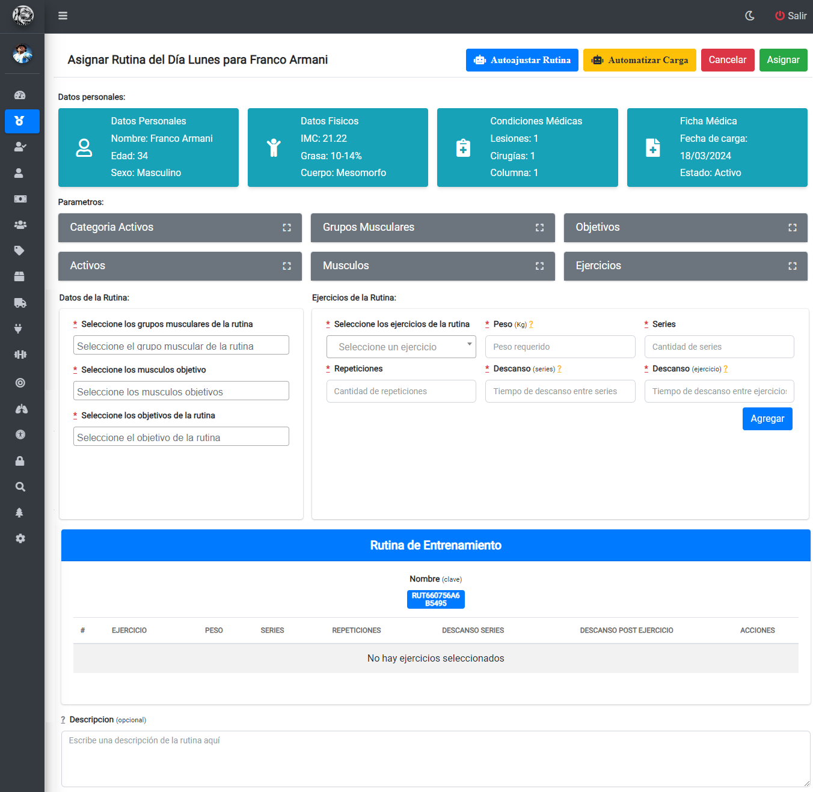
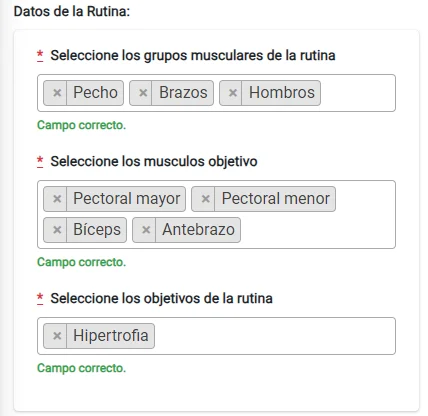
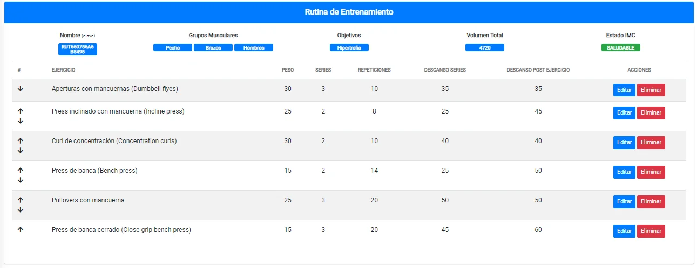

# Asignar Rutina

## Advertencias sobre asignacion de rutina

Una vez haya ingresado al panel `Asignar Rutina` podrá visualizar las siguientes advertencias:

## Asignación de rutinas

Para poder asignar una rutina debe seguir los siguientes pasos:

1. Ingresar a `Grupos de Entrenamiento`.
2. Seleccionar un grupo mediante la acción `Ver`.
3. Identifique el miembro buscado y seleccione la opcion de `Asignar Rutina`.

*Ayuda: Para un mayor nivel de detalle consulte el apartado de Grupos de Entrenamiento.*

Luego será redireccionado a la siguiente vista:

En la barra superior podrá acceder a los datos del miembro:

* `Datos Personales`
* `Datos Físicos`
* `Condiciones Médicas`
* `Ficha Médica`

## Generacion automática de rutinas y ajuste automático de rutinas

Para automatizar la carga de ejercicios o el ajuste en la rutina de ejercicios puede utilizar la opcion de `Automatizar Carga` o `Autoajustar Rutina` en la barra superior derecha. Para ello requiere ingresar los parametros de:

* `Grupos Musculares`
* `Musculos` 
* `Objetivos de rutina`

Los ejercicios se mostrarán en la rutina de la siguiente forma:

El sistema tendrá en cuenta los datos médicos, fisicos y personales del miembro objetivo para determinar los ejercicios adecuados.

*Ayuda: si desea entender como se calculan los valores para determinar los ejercicios adecuados vea la documentacion de código fuente en la sección de `Automatización de Funciones`*