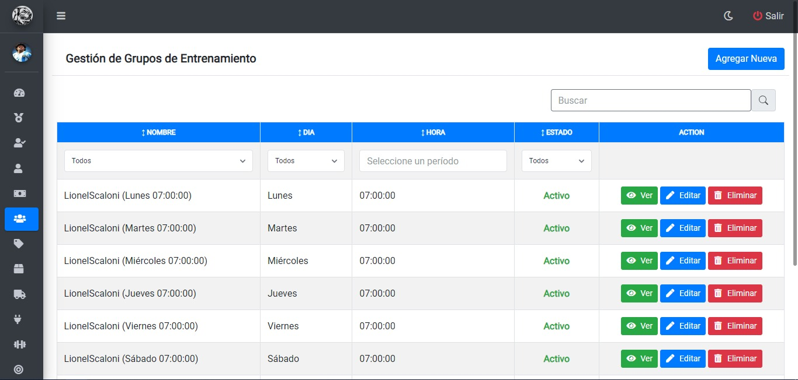
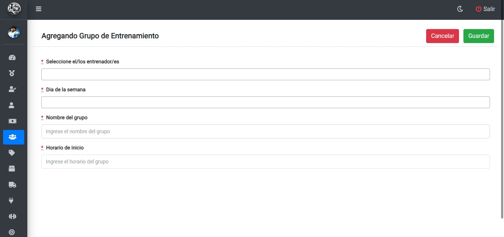
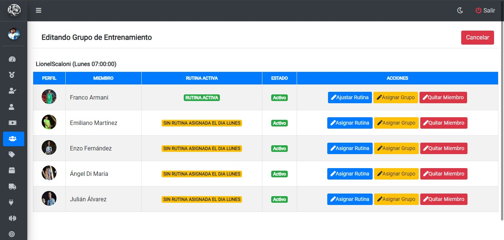
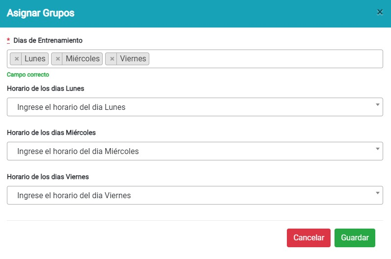

# Grupos de entrenamiento
## Visualizando Grupos de entrenamiento
Una vez haya ingresado al panel `Grupos de entrenamiento` se mostrará la siguiente tabla donde se visualiza una lista de los grupos de entrenamientos:

* Para visualizar los detalles del grupo, deberá hacer clic en el botón `Ver`
## Agregando nuevo grupo
Luego de hacer clic en el botón `Agregar Nueva`, se mostrará la siguiente pantalla donde deberá completar los campos con los datos correspondientes del grupo que desea agregar:

* Una vez completos los campos, para guardar el nuevo grupo de entrenamiento deberá hacer clic en el boton `Guardar`
* Para cancelar, deberá hacer clic en el botón `Cancelar`

## Editando grupo de entrenamiento
Luego de hacer clic en el botón `editar grupo`, se mostrará la siguiente pantalla donde deberá hacer clic en el boton correspondiente a lo que desea editar:

* Si desea ajustar rutina, deberá hacer clic en el boton `Ajustar rutina`
* Si desea asignar grupo, deberá hacer clic en el boton `Asignar grupo`
* Si desea quitar miembro, deberá hacer clic en el boton `quitar miembro`
* Para cancelar, deberá hacer clic en el botón `Cancelar`

###### Asignando grupo de entrenamiento
Luego de hacer clic en el botón `Asignar grupo`, se desplegara el siguiente formulario el cual deberá completar con los datos correspondientes:

* Una vez completos los campos, para guardar el nuevo grupo asignado deberá hacer clic en el boton `Guardar`
* Para cancelar, deberá hacer clic en el botón `Cancelar`