# Gestión de Movimientos
## Visualizando movimientos Registrados
Una vez haya ingresado al panel `Movimientos` podrá visualizar la siguiente tabla donde se visualiza la lista de movimientos:
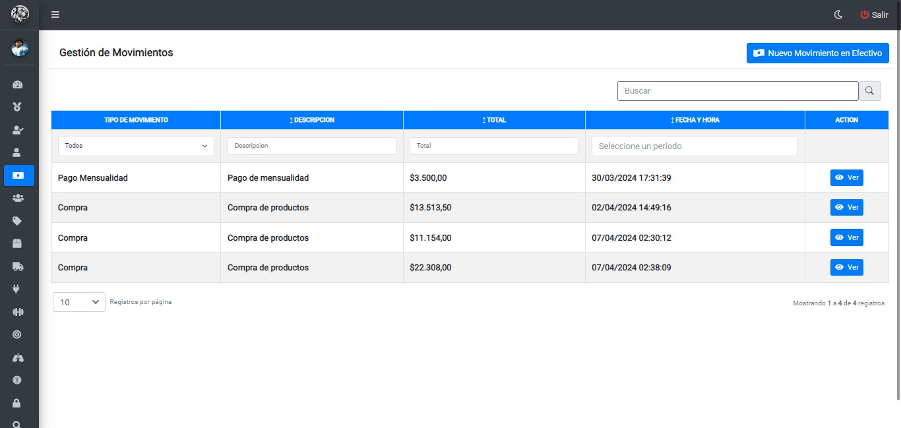

* Para visualizar los detalles del movimiento, deberá hacer clic en el botón `Ver`
## Agregando nuevo movimiento
Luego de hacer clic en el botón `Nuevo movimiento en efectivo`, se mostrará la siguiente pantalla:
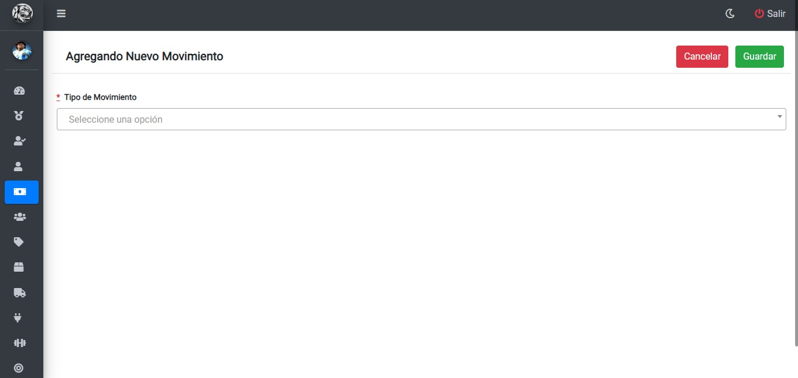

## Agregando movimiento venta:
 Luego de seleccionar en el desplegable `Tipo de movimiento` el movimiento `Venta` deberá seleccionar en los siguientes desplegables los datos correspondientes que desea agregar:
 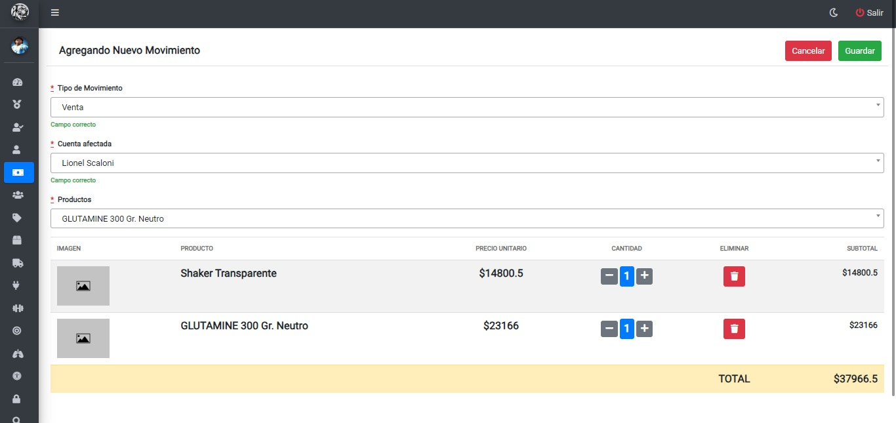

* Para guardar el nuevo movimiento una vez cargado los datos, deberá hacer clic en el botón `Guardar`
* Para cancelar, deberá hacer clic en el botón `Cancelar`

## Agregando movimiento Compra:
 Luego de seleccionar en el desplegable `Tipo de movimiento` el movimiento `compra` deberá seleccionar el producto que desea agregar:
 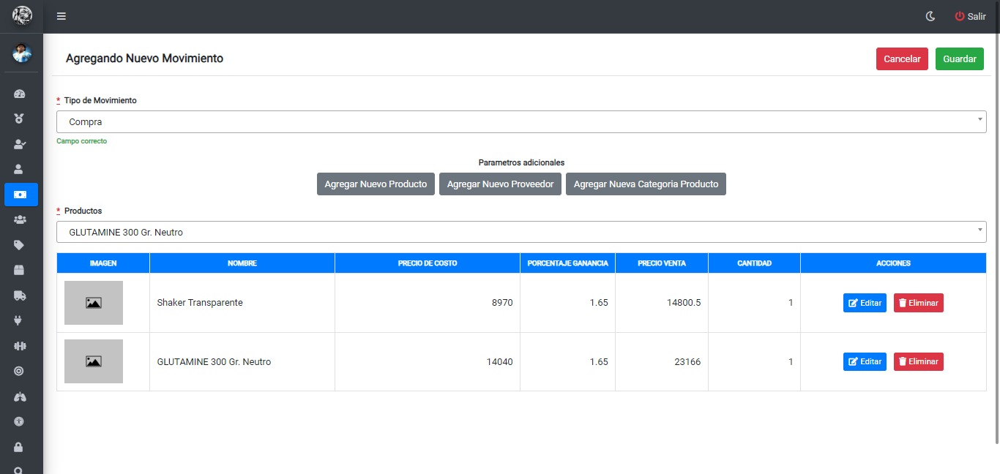

###### Agregando producto:
Si el producto que desea agregar no existe, podrá agregarlo haciendo clic en el boton `Agregar nuevo producto` el cual desplegara el siguiente formulario:
 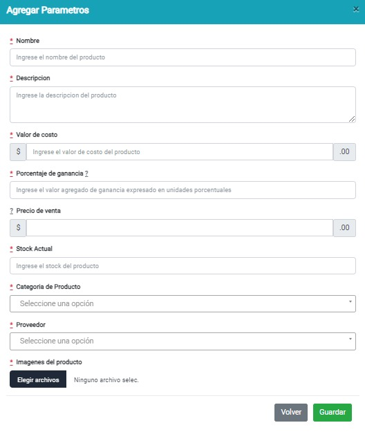

* Una vez completos los campos, para guardar el nuevo producto deberá hacer clic en el boton `Guardar`
* Para cancelar, deberá hacer clic en el botón `volver`

###### Agregando Proveedor:
Si el proveedor del producto que desea agregar no existe, podrá agregarlo haciendo clic en el boton `Agregar nuevo proveedor` el cual desplegara el siguiente formulario:
 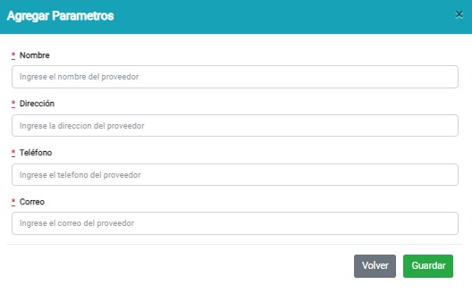

* Una vez completos los campos, para guardar el nuevo proveedor deberá hacer clic en el boton `Guardar`
* Para cancelar, deberá hacer clic en el botón `volver`

###### Agregando Categoría Producto:
Si la categoría del producto que desea agregar no existe, podrá agregarlo haciendo clic en el boton `Agregar nueva Categoría Producto` el cual desplegara el siguiente formulario:
 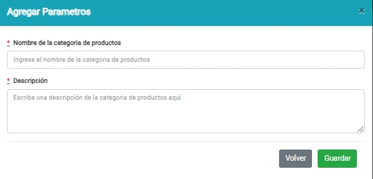

* Una vez completos los campos, para guardar la nueva categoría de Productos deberá hacer clic en el boton `Guardar`
* Para cancelar, deberá hacer clic en el botón `volver`

## Agregando movimiento Pago Mensualidad:
 Luego de seleccionar en el desplegable `Tipo de movimiento` el movimiento `Pago mensualidad` deberá seleccionar al miembro que realizará el pago:
 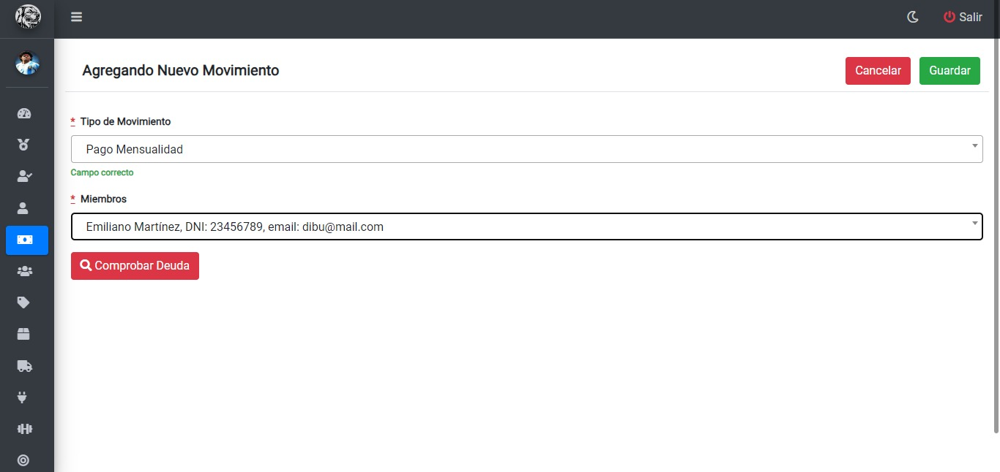

###### Comprobando deuda
Para comprobar la deuda del miembro seleccionado, debera hacer clic en el botón `Comprobar deuda` el cual mostrará la siguiente advertencia: 
 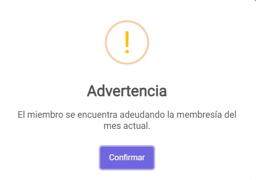

 * Para regresar a la ventana anterior y continuar con el cobro deberá hacer clic en el botón `Confirmar`

###### Cobrando deuda
Luego de comprobar la deuda del miembro seleccionado, para continuar con el cobro debera hacer clic en el botón `Cobrar deuda` el cual mostrará la siguiente advertencia:

 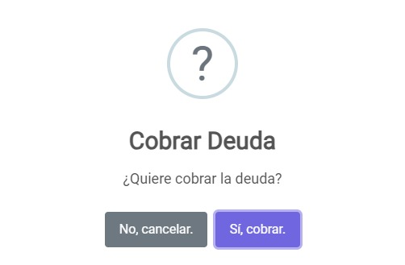

* Para confirmar el cobro deberá hacer clic en el botón `Si, cobrar`
* Para cancelar el cobro deberá hacer clic en el botón `No, Cancelar`
###### Confirmacion de cobro
Una vez realizado el cobro, se mostrará el siguiente mensaje de éxito:
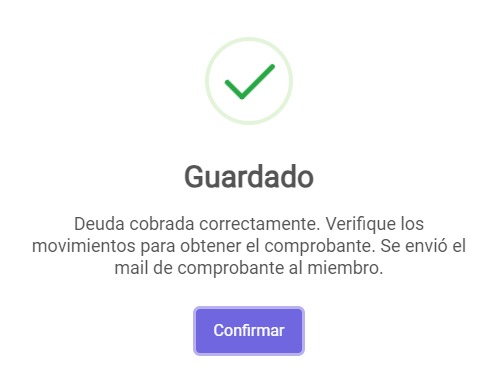
###### Reporte
Una vez realizado el cobro, se generará el siguiente reporte con los detalles del cobro el cual también será enviado al correo del Miembro correspondiente:
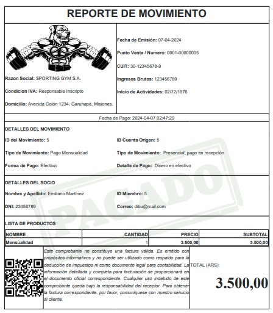

## Agregando movimiento Pago Sueldo:
 Luego de seleccionar  al entrenador correspondiente, para pagar sueldo deberá hacer clic en el botón `Pagar Sueldo`
 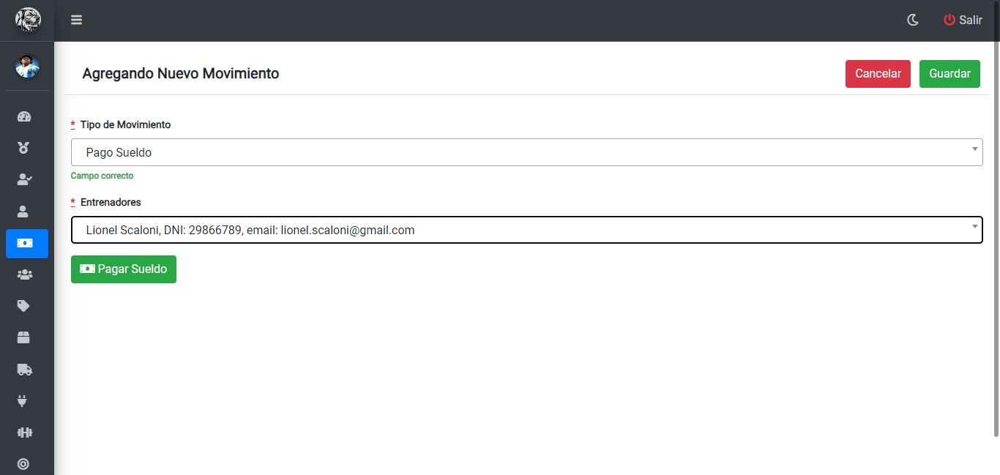
###### Pagando sueldo
Luego de hacer clic en el botón `Pagar Sueldo` se mostrará la siguiente advertencia:
 

* Para confirmar el pago deberá hacer clic en el botón `Si, pagar`
* Para cancelar el pago deberá hacer clic en el botón `No, Cancelar`
###### Reporte
Una vez realizado el pago, se generará el siguiente reporte con los detalles del pago el cual también será enviado al correo del Entrenador correspondiente:
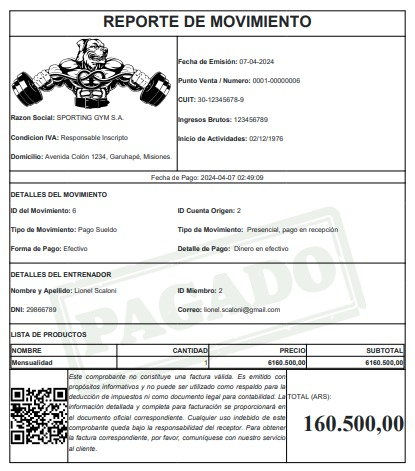