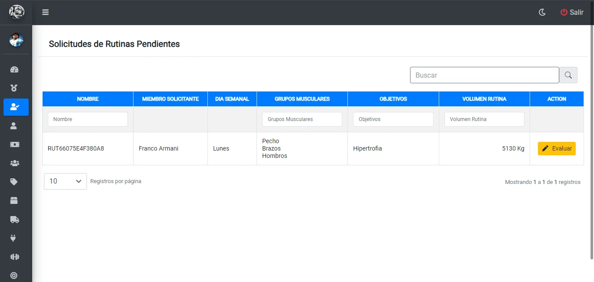
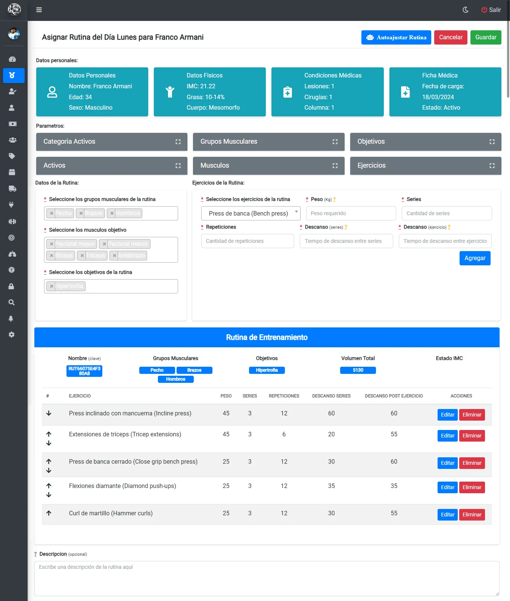

# Solicitud de Evaluación de Rutina

## Vista principal de las solicitudes de evaluacion pendientes

Una vez haya ingresado al panel `Solicitudes Rutina` podrá visualizar la siguiente tabla:

Para evaluar una solicitud debe seleccionar la opcion `Evaluar` de la rutina objetivo.

## Evaluar una rutina de entrenamiento

Una vez seleccione la rutina a evaluar se cargará la siguiente pantalla:

En esta sección podrá modificar los ejercicios y sus parametros como peso, series, repeticiones y descansos. Luego de realizar los ajustes pertinentes seleccione la opcion de `Guardar` en la equina superior derecha.

*Ayuda: si desea acceder a los datos personales, fisicos, medicos y ficha medica puede utilizar la barra superior como se detalla en la seccion `Asignar Rutina`*