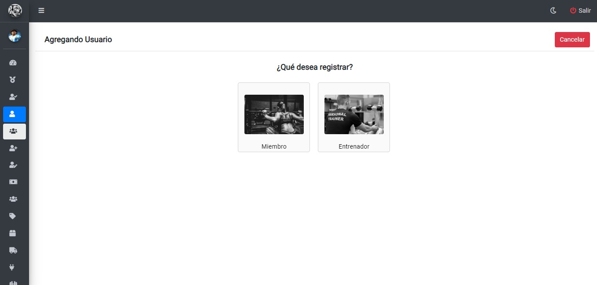
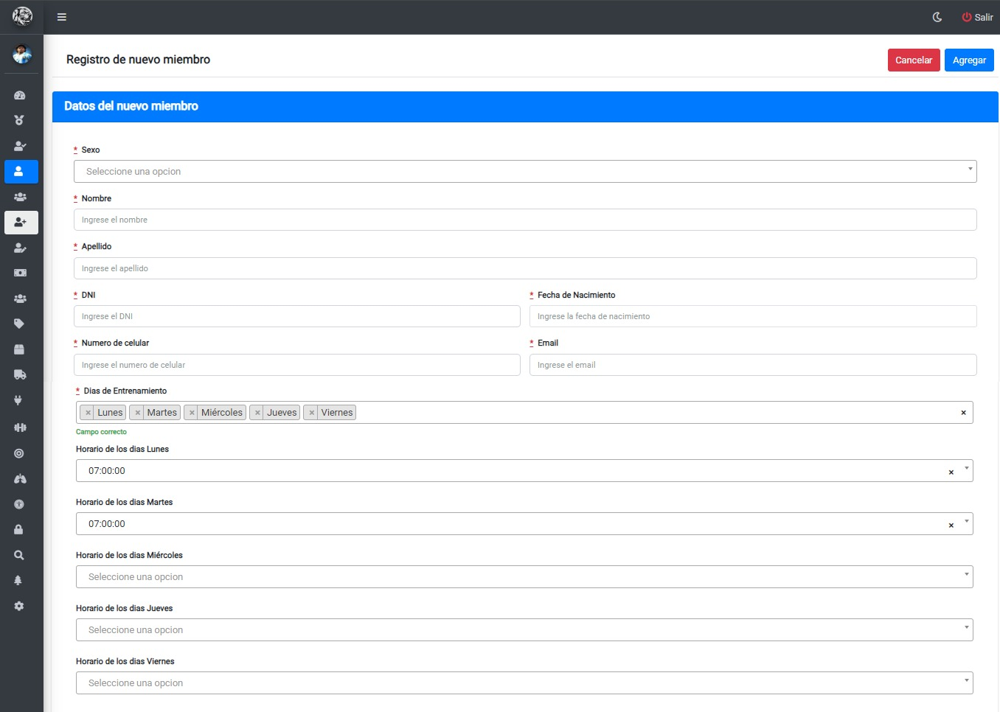
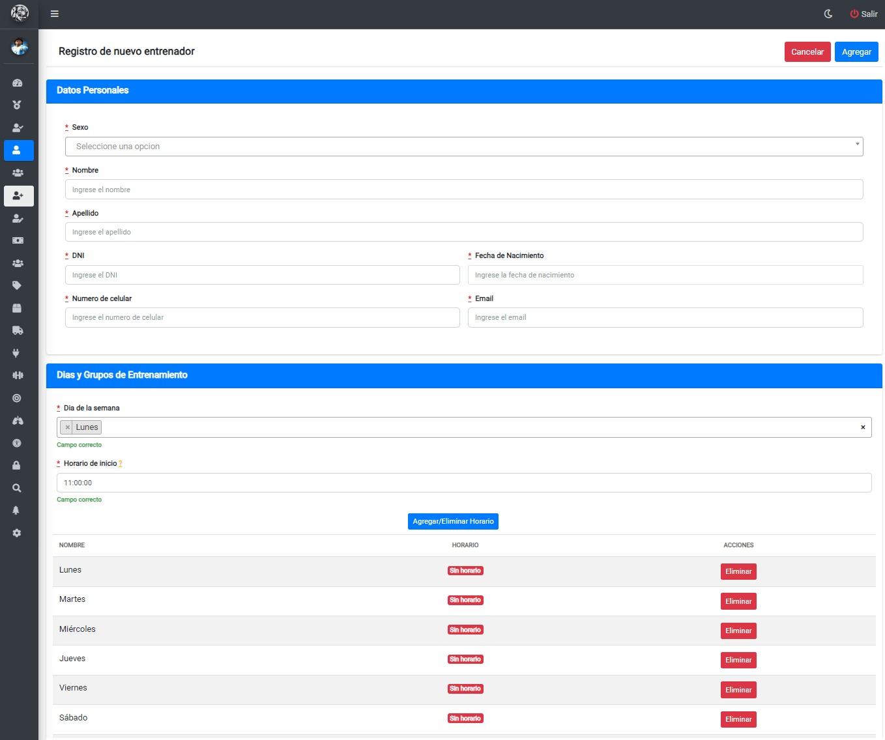
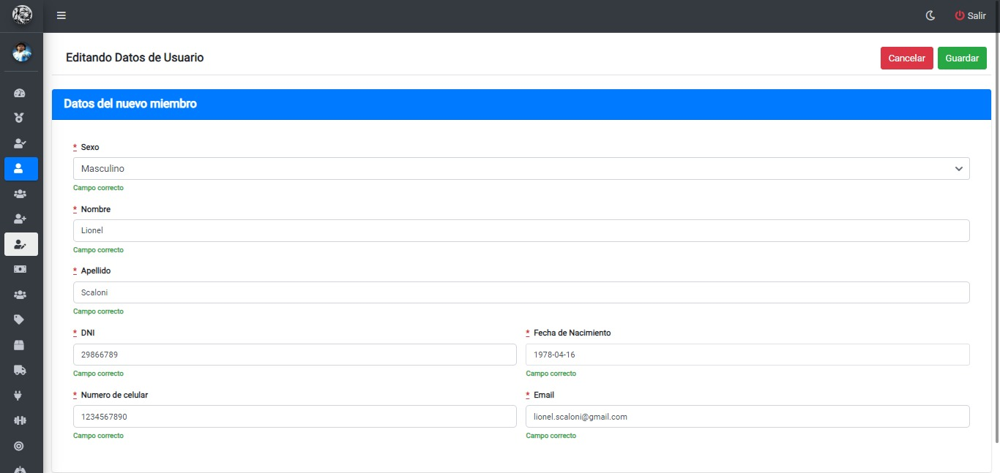

# Gestión de Usuarios 

## Visualizando los usuarios registrados

Una vez haya ingresado a `Gestionar Usuarios` podrá visualizar una tabla similiar a la siguiente:

## Agregando usuarios
Luego de hacer clic en el botón `Agregar Nuevo` , se mostrará la siguiente pantalla donde podrá elegir el tipo de usuario que desa registrar:

## Registro de nuevo miembro
Una vez seleccionado `Miembro` como tipo de usuario a registrar , podrá visualizar el siguiente formulario donde deberá completar los campos con sus respectivos datos:

* Para completar el registro una vez cargado los datos, deberá hacer clic en el botón `Agregar`
* Para cancelar el registro, deberá hacer clic en el botón `Cancelar`

## Registro de nuevo entrenador
Una vez seleccionado `entrenador` como tipo de usuario a registrar, podrá visualizar el siguiente formulario donde deberá completar los campos con sus respectivos datos:

* Para agregar cada dia que asistirá el entrenador con sus horarios correspondientes, deberá seleccionar en los desplegables "Día de la semana" y "Horario de inicio" respectivamente y luego hacer clic en el botón `Agregar/eliminar Horario`.
* Para eliminar un Horario, deberá seleccionar el día y el horario que desea eliminar y luego hacer clic en el botón `Agregar/eliminar Horario`.
* Para completar el registro una vez cargado los datos, deberá hacer clic en el botón `Agregar`
* Para cancelar el registro, deberá hacer clic en el botón `Cancelar`

## Editando Datos de usuarios
Luego de hacer clic en el botón `Editar` , se mostrará la siguiente pantalla donde podrá editar los datos del usuario:

* Para guardar los datos actualizados, deberá hacer clic en el botón `Guardar`
* Para cancelar la edición de datos, deberá hacer clic en el botón `Cancelar`