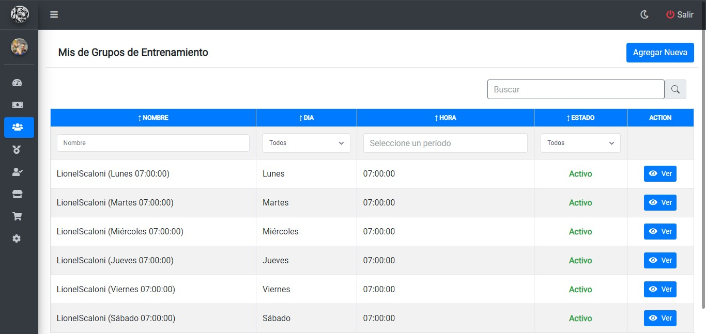
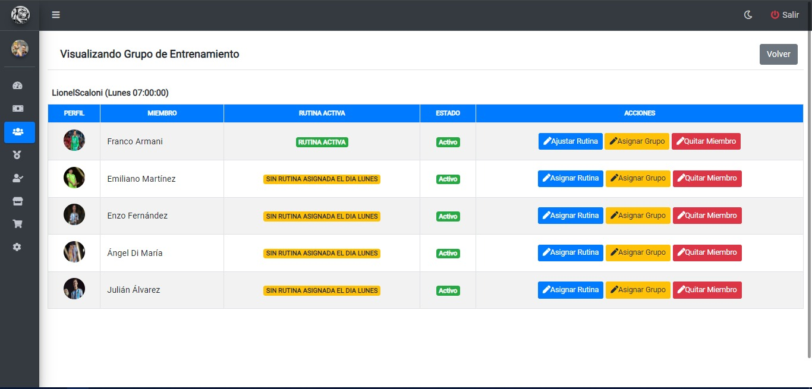
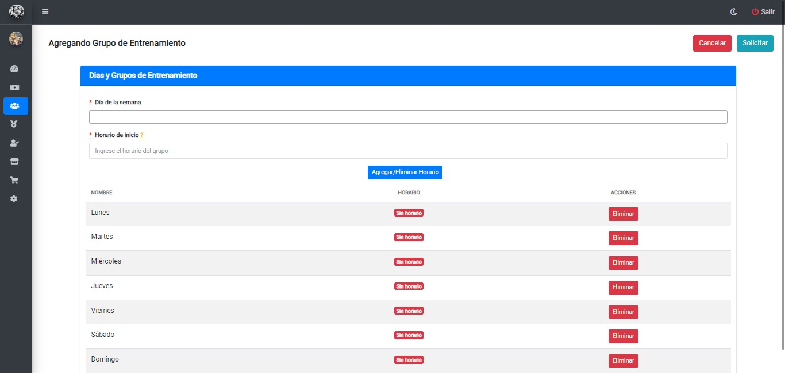

# Grupos de entrenamiento
## Mis Grupos de entrenamiento
Una vez haya ingresado al panel `Mis grupos` se muestra la siguiente tabla donde se visualiza una lista de los grupos de entrenamientos asignados:

* Para visualizar los detalles del grupo, deberá hacer clic en el botón `Ver`
## Visualizando mis Grupos de entrenamiento
Luego de hacer clic en el botón `Ver` se muestra la siguiente tabla donde se pueden visualizar los detalles del grupo:

* Para regresar a la pantalla anterior, debera hacer clic en el boton `volver`
## Agregando Grupo de entrenamiento
Luego de hacer clic en el botón `Agregar Nueva`, se mostrará la siguiente pantalla donde deberá completar los campos con los datos correspondientes del grupo que desea agregar:

* Para agregar/eliminar horario, debera seleccionar el horario y día correspondiente y hacer clic en botón `Agregar/eliminar Horario`
* Una vez completos los campos, para solicitar el nuevo grupo de entrenamiento deberá hacer clic en el boton `Solicitar`
* Para cancelar, deberá hacer clic en el botón `Cancelar`