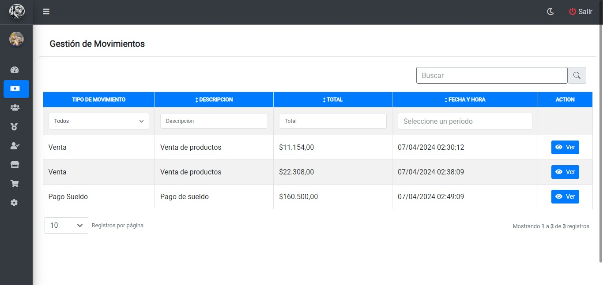
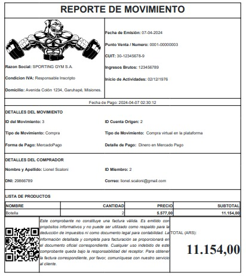

# Gestión de Movimientos
## Visualizando mis movimientos
Una vez haya ingresado al panel `Movimientos` podrá visualizar la siguiente tabla donde se visualiza la lista de movimientos:

* Para visualizar los detalles del movimiento, deberá hacer clic en el botón `Ver`
## Visualizando reporte de movimiento
Luego de hacer clic en el botón `ver` podrá visualizar el reporte detallado del movimiento:
