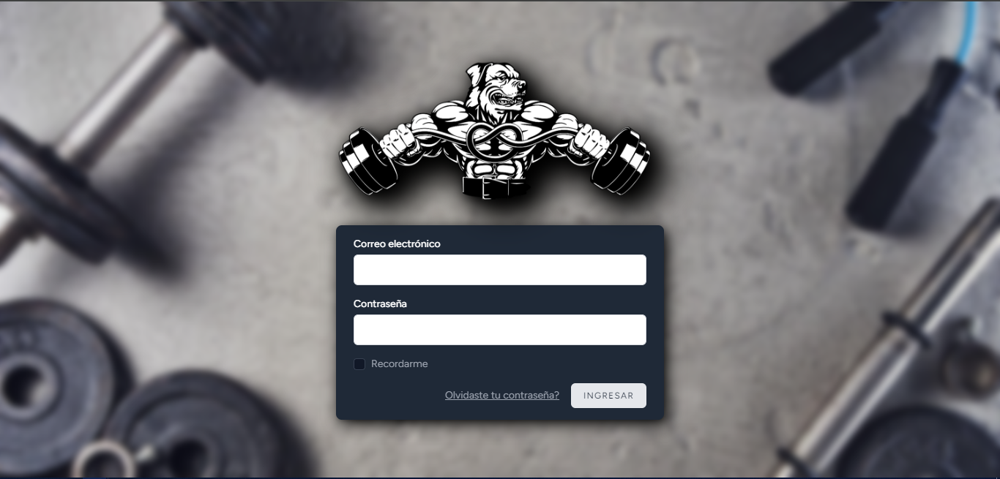
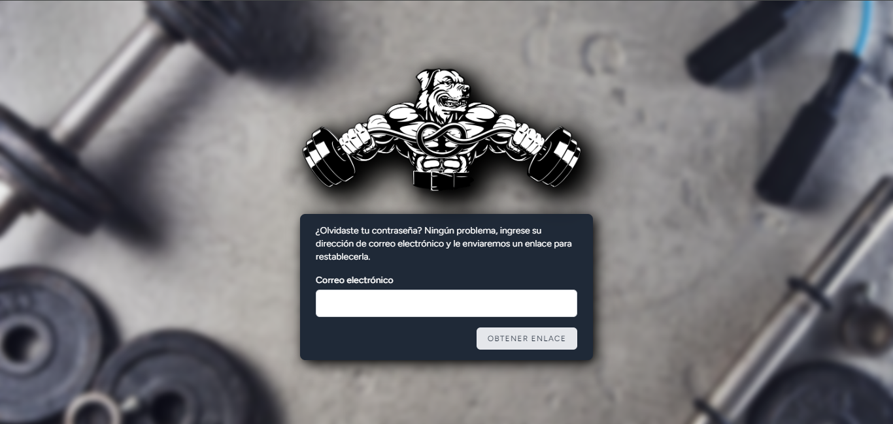
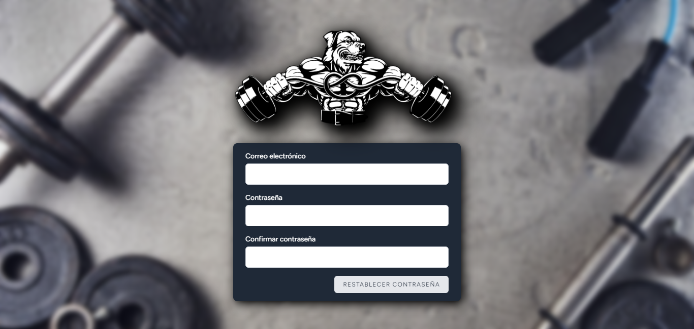

# Inicio de Sesión

## Iniciando sesión en el sistema.

1. Ingrese a la web del sistema
2. En el campo email ingrese su correo electronico.
3. En el campo contraseña ingrese su clave de inicio.
4. Luego de verificar los campos cargados presione en `INGRESAR`

## Olvidé mi contraseña.

1. Si olvidaste tu contraseña la puedes reestablecer presionando `Olvidaste tu contraseña?`. Se mostrará una pantalla en donde debe ingresar su correo electronico y presionar `OBTENER ENLACE`.

2. Una vez ingresa al enlace obtenido en su correo electronico se mostrará la siguiente pantalla:

3. Debe ingresar su correo electronico, una nueva contraseña y validarla volviendo a ingresar nuevamente la contraseña en el tercer campo solicitado.
4. Luego de validar los datos debe presionar en `REESTABLECER CONTRASEÑA`.
5. Será redireccionado a la pantalla de inicio de sesión donde podrá iniciar su cuenta con la nueva contraseña establecida.

*Ayuda: Si no encuentra una solucion a algun problema específico debe contactarse con el administrador del sistema*
