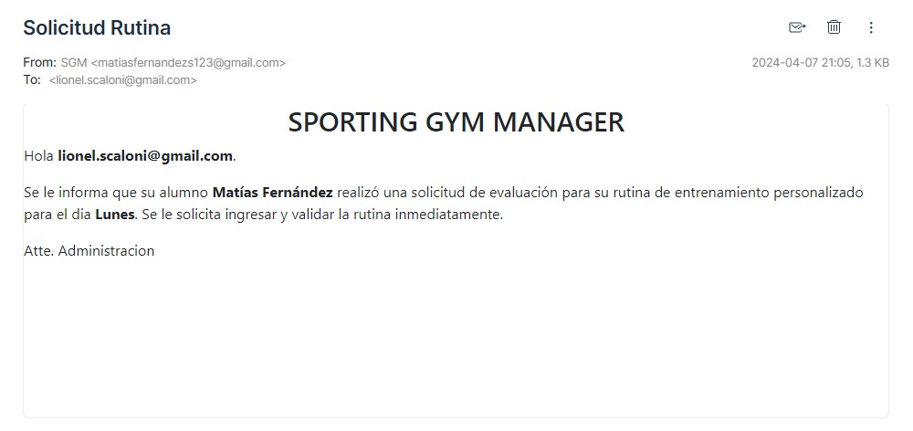

# Rutinas
## Agregar rutina
Una vez haya ingresado al panel `Agregar Rutina` se mostrará la siguiente pantalla: 

* Puede completar los campos y agregar los ejercicios que desee haciendo clic en el botón `Agregar` o bien hacer clic en el botón `Automatizar carga` donde se generará una rutina automaticamente en base a los datos de la rutina cargados anteriormente.
* En la parte inferior podrá visualizar una vista previa de los ejercicios cargados.
* Si desea eliminar o editar algún ejercicio podrá hacerlo haciendo clic en los botones `Editar` o `Eliminar` segun lo desee.
* Una vez cargados los ejercicios para solicitar dicha rutina deberá hacer clic en el boton `Asignar`.

###### Mensaje de alerta
Luego de hacer clic en el botón `Agregar` se mostrará el siguiente mensaje de alerta:

* Si desea confirmar la solicitud de rutina deberá hacer clic en el botón `Confirmar`
* Si desea cancelar la solicitud de rutina deberá hacer clic en el botón `cancelar`

Si confirma la solicitud se mostrará el siguiente mensaje de éxito:

## Solicitando Rutina
Una vez confirmada la asignacion de la rutina, se le enviará un correo al entrenador correspondiente el cual aprobará o rechazará la rutina. El mail de solicitud se verá de la siguiente manera:

## Visualizacion Rutina Pendiente
Una vez solicitada la rutina, se verá la siguiente pantalla con su estado de solicitud (Pendiente):

## Aprobacion de solicitud
Una vez que el entrenador apruebe la solicitud de rutina, se le notificará con el siguiente mail:

## Visualizacion Rutina Aprobada
Una vez Aprobada la rutina, se verá la siguiente pantalla con su estado (Aprobada):

* En la parte superior se puede ver la informacion general de la rutina.
* Para ver los detalles de la rutina deberá hacer clic en el botón `Ver`
