# Completar Sesion de Entrenamiento
## Visualizando sesión
Luego de hacer clic sobre la rutina del día, la cual se puede visualizar en la parte superior del panel de mis rutinas, se mostrará la siguiente pantalla:

* Para iniciar la rutina deberá hacer clic en el botón `Iniciar`
* Para regresar al panel mis rutinas deberá hacer clic en el botón `Regresar a rutinas`
* Si desea imprimir la rutina podrá hacerlo guradando la rutina en pdf, haciendo clic en el botón `Guardar PDF`
## Iniciando sesión de entrenamiento
Luego de hacer clic sobre el botón `Iniciar` se mostrará la siguiente alerta:
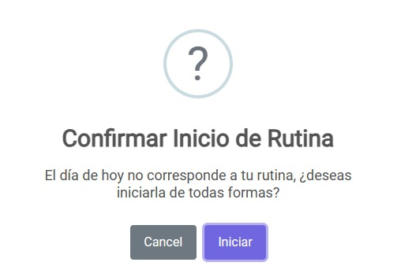

* Para iniciar la rutina deberá hacer clic en el botón `Iniciar`
* Si desea cancelar deberá hacer clic en el botón `Cancelar`
## QR inicio sesión de entrenamiento
Luego de hacer clic sobre el botón `Iniciar`, deberá escanear el QR generado por el sistema en el lector de QR del gimnasio:
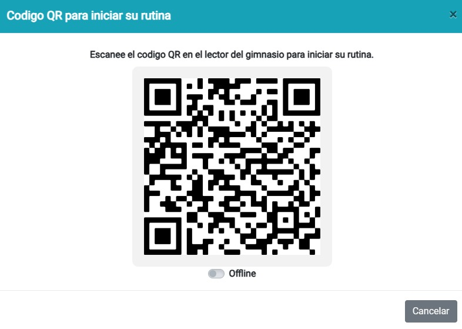

## Iniciando rutina de entrenamiento
Luego de escanear el QR, el sistema lo redirigirá a la siguiente pantalla donde pordrá continuar y empezar a completar los ejercicios de la rutina:
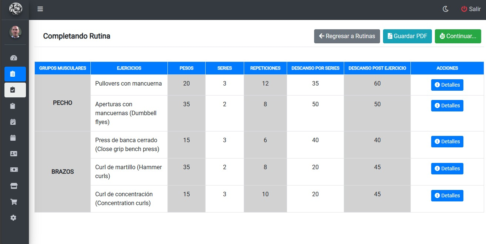

* Para continuar y empezar a completar los ejercicios de la rutina, deberá hacer clic en el botón `Continuar`

###### Alerta continuar con la rutina
Una vez que haga clic sobre el boton `Continuar`, se le mostrará la siguiente advertencia:
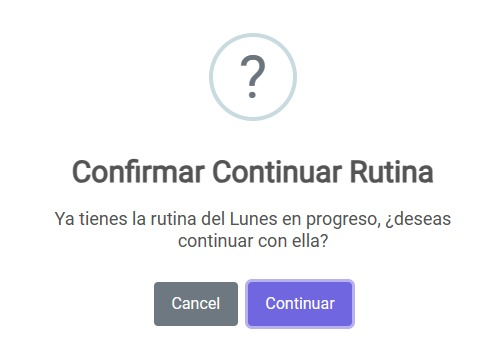

* Si desea continuar, deberá hacer clic en el botón `Continuar`
* Si desea cancelar, deberá hacer clic en el botón `Cancel`
## Completando sesion:
Luego de hacer clic sobre el botón `Continuar`, podrá visualizar la siguiente pantalla con los ejercicios correspondientes a la sesión:
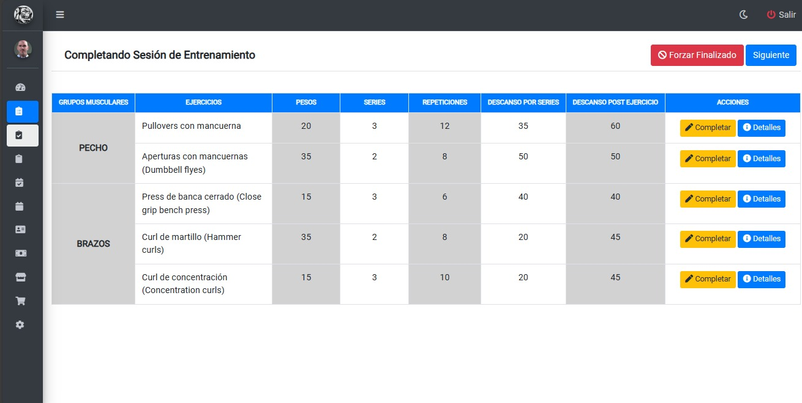

* Para marcar el ejercicio que completó, debera hacer clic sobre el botón `Completar`
* Si desea ver informacion detallada sobre el ejercicio deberá hacer clic sobre el botón `Detalles`
###### Detalles de ejercicio
Luego de hacer clic sobre el botón `Detalles`, se le mostrará la siguiente pantalla donde podrá observar:

* *Instrucciones*
* *Musculos trabajados*
* *Equipamiento necesario*
* *Técnica correcta*
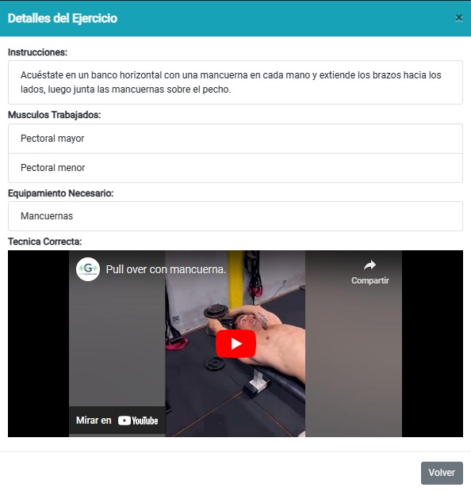

###### Completando ejercicio:
Una vez que haya completado el ejercicio, para marcarlo como hecho, deberá hacer clic sobre el botón `Completar` el cual mostrará la siguiente alerta:
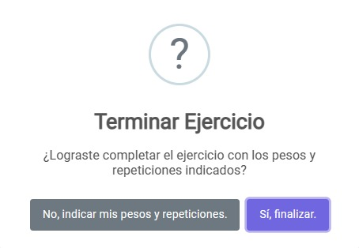

* En caso de haber cumplido con las especificaciones del ejercicio, deberá hacer clic sobre el botón `Si, finalizar`
###### Visualizacion ejercicio completo
Luego de confirmar la finalizacion del ejercicio indicado en la rutina, se podrá observar su estado (Completo) como en la siguiente pantalla:
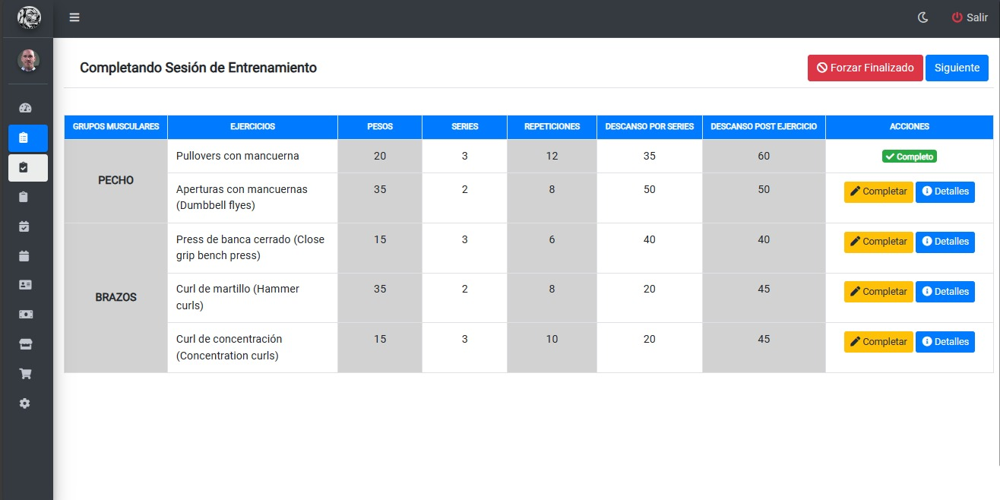
###### Corrigiendo datos reales
En caso de no haber cumplido con las especificaciones dadas en el ejercicio, podrá especificar los datos reales que cumplió haciendo clic en el botón `No, indicar mis pesos y repeticiones` el cual mostrá la siguiente pantalla:
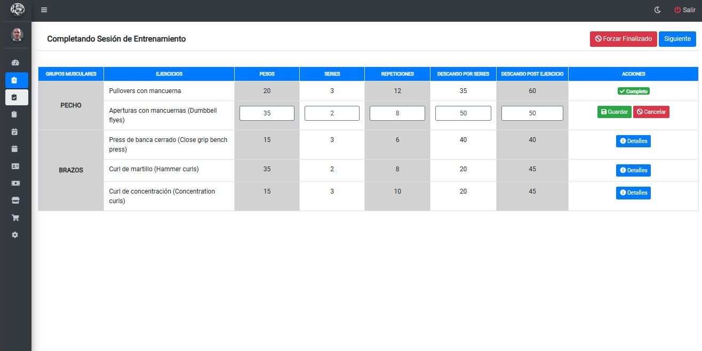

###### Confirmando datos reales
Una vez cargado los datos, para guardarlos deberá hacer clic sobre el boton `Guardar` donde se mostrará la siguiente alerta:

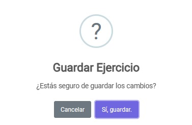

* Si desea guardar los cambios, deberá hacer clic en el botón `Si, guardar`
* Si desea cancelar, deberá hacer clic en el botón `Cancelar`
## Especificando datos corporales
Una vez finalizada la sesión, deberá indicar su porcetantaje de masa y su porcentaje de grasa corporal como se puede observar en la siguiente pantalla:
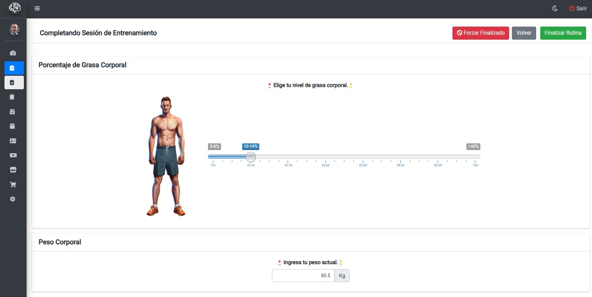

## Finalizando sesión completa
Si realizó toda la sesión, podrá finalizarla haciendo clic sobre el botón `Finalizar rutina` lo cual mostrará la siguiente alerta:

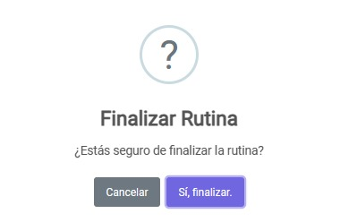

* Para confirmar la finalizacion de la sesión, debera hacer clic sobre el botón `Si, finalizar`
* Si desea cancelar, deberá hacer clic en el botón `Cancelar`

## Finalizando sesion Incompleta
En caso de no haber realizado todos los ejercicios de la sesión, al hacer clic sobre el botón `Finalizar rutina` mostrará el siguiente mensaje:

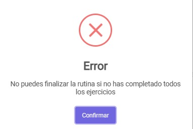

###### Forzando finalización de la sesión
En caso de no haber completado todos los ejercicios de la sesión, podrá forzar el finalizado haciendo clic sobre el botón `Forzar finalizado` lo cual mostrará la siguiente alerta:
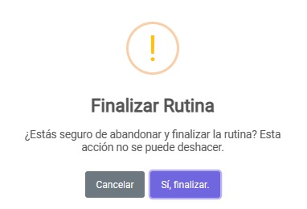

* Para confirmar la finalizacion de la sesión, debera hacer clic sobre el botón `Si, finalizar`
* Si desea cancelar, deberá hacer clic en el botón `Cancelar`

## Visualizando sesiones de rutina
Una vez finalizado una sesión, se podrá observar en la parte superior del panel "*Mis rutinas*" como se descuenta las sesiones que quedan (ej: quedan 7 sesiones):

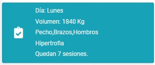
###### Advertencia rutina semanal
En caso de querer iniciar una nueva sesion de la rutina en la misma semana que ya realizó una, le mostrará el siguiente mensaje:

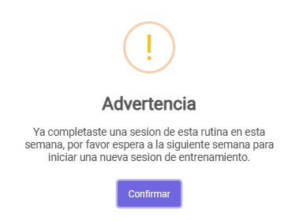