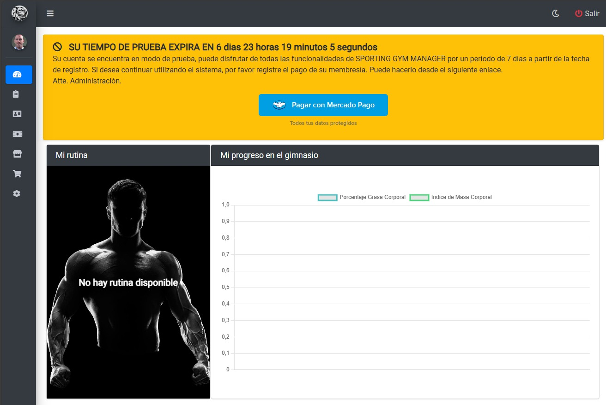
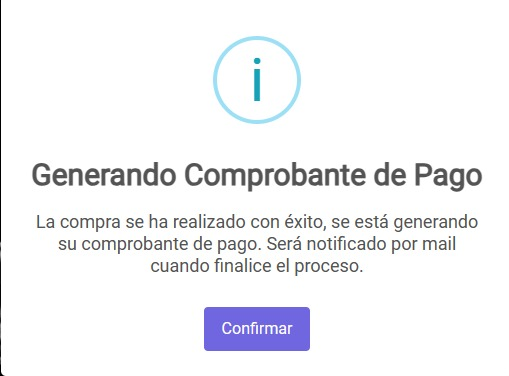

# Dashboard Miembro

## Visualizando Dashboard
Una vez haya ingresado al `Dashboard` podrá visualizar la siguiente pantalla:

* En la parte superior se puede visualizar una advertencia con el estado de prueba, una vez pasados los 7 días de prueba deberá pagar la mensualidad haciendo clic en el botón `Pagar con mercado pago` o bien, acercarse a la recepción del gimnasio para abonar la mensualidad y actualizar el estado de cuenta de "usuario de prueba" a "miembro".
*  En el panel de `Mi rutina` podrá observar las rutinas activas.
*  En el panel de `Mi progreso en el gimnasio` podrá observar un gráfico con el progreso evaluando el porcentaje de grasa corporal y el índice de masa corporal.

## Pagando Membresía
Una vez hecho clic en el botón `Pagar con mercado pago` y haber efectuado el pago de la membresía, se mostrará el siguiente mesaje:
