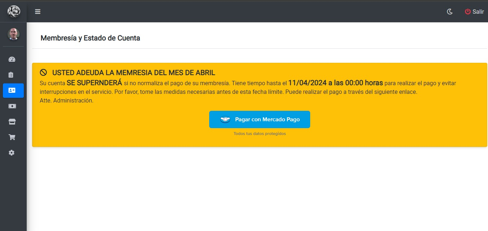
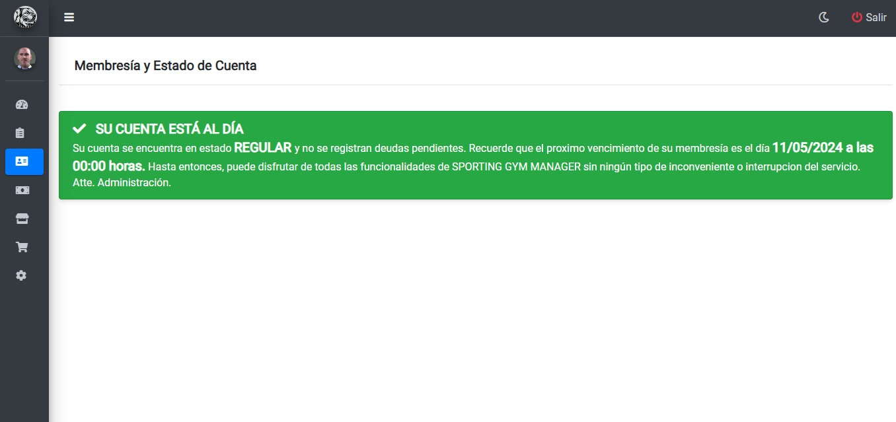

# Pantalla membresía
Una vez haya ingresado al panel `Membresía` se mostrará una pantalla donde se podrá visualizar el estado de la cuenta:
###### Estado de cuenta *Miembro Deudor*
En el caso de no estar al dia con el pago de mensualidad, en el panel de *Membresía* se le mostrará la siguiente pantalla:

* Para pagar la mensualidad podrá hacer clic sobre el botón `Pagar con mercado pago` o bien, acercarse a la recepción del gimnasio y efectuar el pago de manera presencial.

###### Estado de cuenta *Miembro*
Luego de efectuar el pago de mensualidad, en el panel de *Membresía* se le mostrará la siguiente pantalla:
