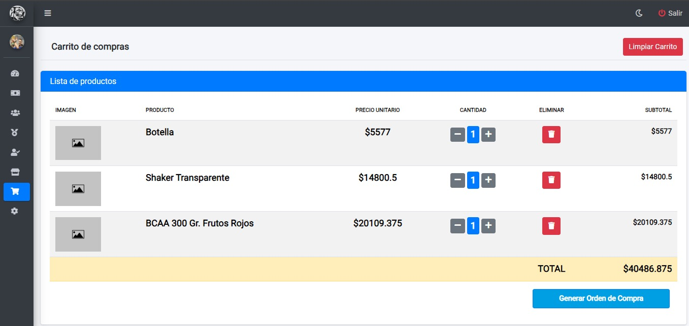
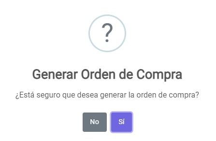
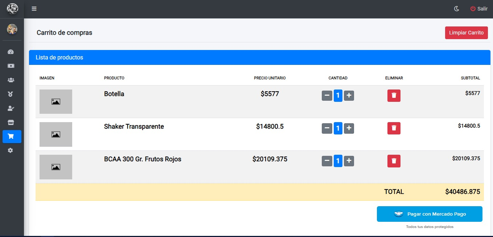
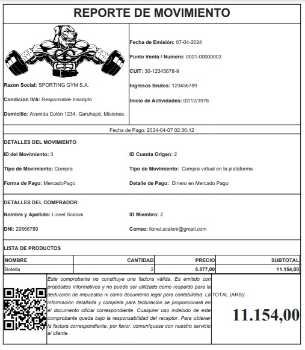

# Carrito
## Pantalla carrito
Una vez haya ingresado al panel `Carrito` se muestra la siguiente pantalla donde se visualizan los productos agregados al carrito:

## Generando orden de compra
Para generar la orden de compra deberá hacer clic en el botón `Generar orden de compra`

* Si desea generar la orden de compra, deberá hacer clic sobre el botón `Si`
* Si desea cancelar, deberá hacer clic en el botón `No`
## Visualizando carrito con orden de compra
Una vez generada la orden de compra, se muestra la siguiente pantalla donde tendrá la opción de `Pagar con Mercado Pago` para realizar el pago de la compra.

## Comprobante de compra
Una vez efectuado el pago, el sistema genera un comprobante de compra exitosa. 

* Ejemplo:

