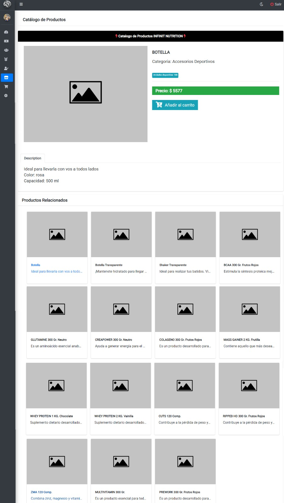
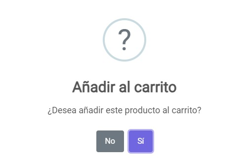

# Catálogo
## Pantalla catálogo
Una vez haya ingresado al panel `Catálogo` se muestra la siguiente pantalla donde se visualizan los productos disponibles para su compra:

## Agregando al carrito
Si desea agregar al carrito algún producto, luego de seleccionarlo deberá hacer clic sobre el botón `Añadir cal carrito` lo cual mostrará la siguiente alerta:

* Si desea agregar el producto al carrito, deberá hacer clic sobre el botón `Si`
* Si desea cancelar, deberá hacer clic en el botón `No`
