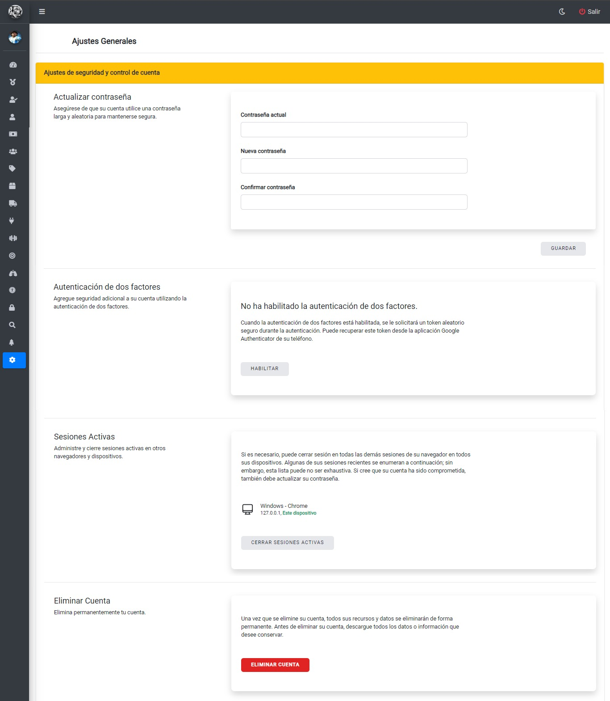

# Seguridad y Ajustes
## Pantalla seguridad y ajustes
Una vez ingresado al panel `Seguridad y Ajustes` podrá visualizar la siguiente pantalla donde podrá realizar las siguientes acciones:

* *Actualizar Contraseña*
* *Autenticación de dos factores*
* *Gestión de Sesiones Activas*
* *Eliminar cuenta*
